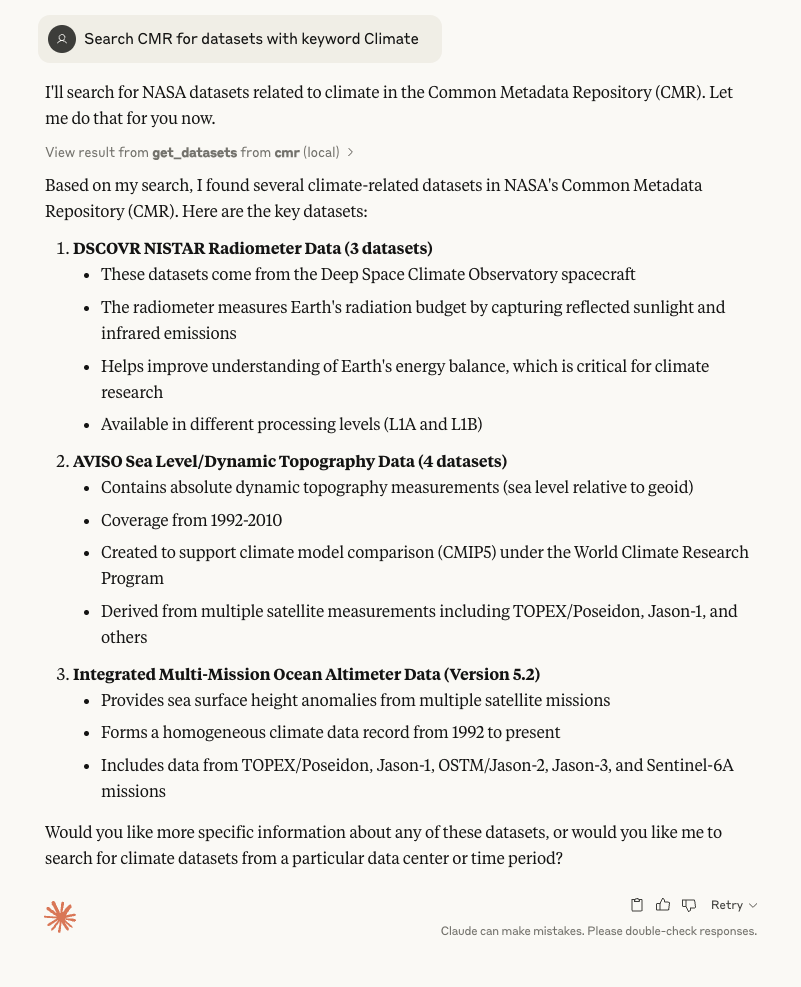

# Model Context Protocol (MCP) for NASA Earthdata Search (CMR)

This module is a [model context protocol](https://modelcontextprotocol.io/introduction) (MCP) for NASA's earthdata common metedata repository (CMR). The goal of this MCP server is to integrate AI retrievals with NASA Catalog of datasets by way of Earthaccess.

## Dependencies
uv -  a rust based python package manager
a LLM client, such as Claude desktop or chatGPT desktop (for consuming the MCP)

## Install and Run

Clone the repository to your local environment, or where your LLM client is running.


### Install uv 

```
curl -LsSf https://astral.sh/uv/install.sh | sh
```


```
uv venv
source .venv/bin/activate
```

###  Install packages with uv
```
uv sync
```

use the outputs of `which uv` (UV_LIB) and `PWD` (CMR_MCP_INSTALL) to update the following configuration.


## Adding to AI Framework

In this example we'll use Claude desktop.

Update the `claude_desktop_config.json` file (sometimes this must be created). On a mac, this is often found in `~/Library/Application\ Support/Claude/claude_desktop_config.json`

Add the following configuration, filling in the values of UV_LIB and CMR_MCP_INSTALL - don't use environment variables here.

```
{
    "mcpServers": {
        "cmr": {
            "command": "$UV_LIB$",
            "args": [
                "--directory",
                "$CMR_MCP_INSTALL$",
                "run",
                "cmr-search.py"
            ]
        }
    }
}
```

## Use the MCP Server

Simply prompt your agent to `search cmr for...` data. Below is a simple example of this in action.



Other prompts that can work:

1. Search CMR for datasets from 2024 to 2025
2. Search CMR for PO.DAAC datasets from 2020 to 2024 with keyword Climate


